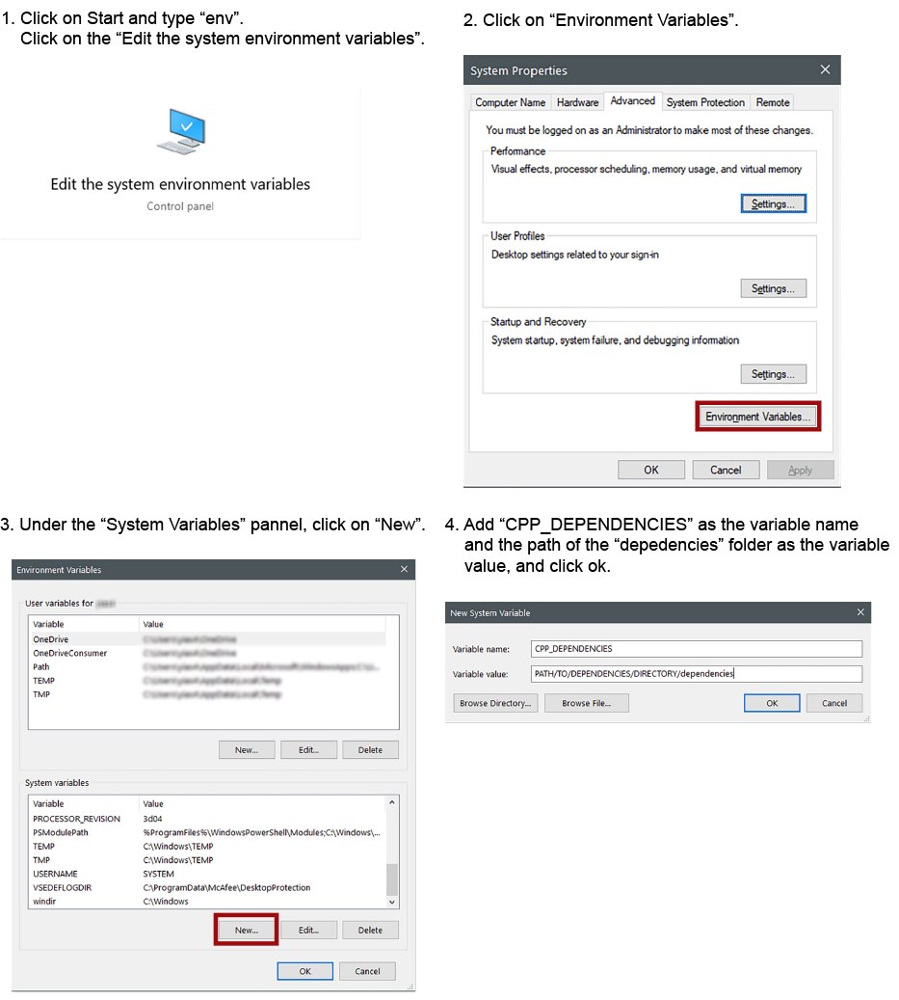
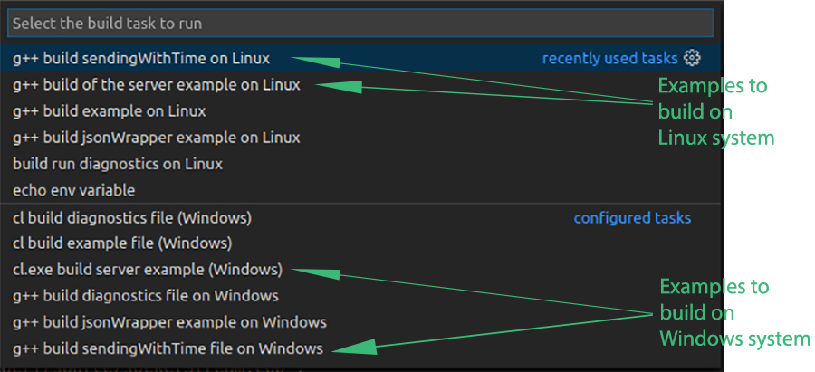
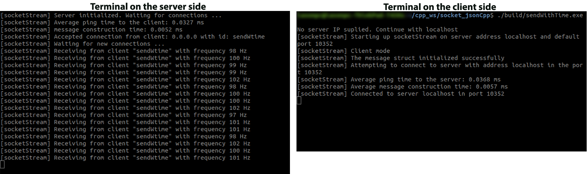

A cros-platform C++ library and Python module for exchanging packets over a TCP/IP communication. The socketSteam class supports both client and server implementations on C++ and python. The packets follow the json structure, making them compatible with other languages too. The C++ library supports multi-client server, whilst the server of the python class services only one client. 

The C++ implementaion of md5 checksum is a RSA Data Security, Inc. MD5 Message-Digest Algorithm, borrowed from zedwood in this [link](http://www.zedwood.com/article/cpp-md5-function). Besides the md5 implementation, the rest of the code is distributed under the GNU GPLv3 license.

The package requires at least C++11 or Python version greater or equal to 2.7.

## Set-up
The header files and source code could be included and compiled together with the custom project. The lpthread library should be linked for compiling the project. 

To install the library on a Linux PC (having cloned rapidjson as the included submodule) run the following commands:
```bash
$ make
$ sudo make install
```
If you don't want to have rapidjson as a submodule, follow the following steps to set it as an external dependency and change the path to the include files in the make file.

1) Open a terminal or command prompt (on Windows) and navigate to your workspace. In your workspace folder, create a folder called "dependencies" to contain the cpp dependencies (if it doesn't already exist)

```bash
$ mkdir dependencies
```

2) go inside the folder dependencies and clone the rapidjson library from their [github repo](https://github.com/Tencent/rapidjson/)

```bash
$ cd dependencies
$ git clone https://github.com/Tencent/rapidjson.git
```

3) create an environment variable to contain the path of the dependencies directory

-- On Linux

Open the .bashrc file in your hone directory

```bash
$ cd
$ sudo gedit .bashrc
```

add the following line at the end of the file

export CPP_DEPENDENCIES="PATH/TO/DEPENDENCIES/DIRECTORY/dependencies"

*the "PATH/TO/DEPENDENCIES/DIRECTORY" corresponds to the path where of the folder "dependencies" that is created on the 1st step. If you don't know the path, navigate to the folder "dependencies" in a terminal (or command prompt on Windows) and type "pwd", it will print the path of this directory 

close the .bashrc file and relaunch the terminal. If you want to be sure that the variable is set properly, type the following command in the terminal (or command prompt on Windows)

```bash
$ echo $CPP_DEPENDENCIES
```

and it should print the path on the folder "dependencies"

-- On Windows



4) clone the socketStream package in workspace directory

```bash
$ git clone https://github.com/yias/socket_jsonCpp.git
```

## Building and running the examples
As the prokect has been developed on VSCode, the file "tasks.json" inside the folder ".vscode" contains the compiler's commands to build the examples in the "examples" folder. If you have VSCode installed on your system, open a terminal on Linux or a command promt on Windows (preferably a [PowerShell](https://github.com/PowerShell/PowerShell)), navigate to the project's folder and rum the command:

```bash
$ code .
```

to launch VSCode. The IDE recognizes automatically the "tasks.json" file and you can build the examples by clicking CTLR+SHIFT+B and select the programm you would like to build by selecting the task on the menu. Each task indicates the OS that can generate the executables (see the picture below). As a test, you can build the server example (serverExample) and the client sendWithTime on the operating system.



-- For Linux, there is an option to build the examples by using the Makefile. For doing so, open a terminal, navigate inside the project's folder, and run the command:

```bash
$ make
```

(for building all the examples inside the "examples", run the command make all)

Either by building from VSCode or the Makefile, two executables will be generated inside the folder "build". The "serverExample" runs a socketStream server that waits for clients to connect and receives their packets. The "sendWithTime" runs a socksetStream client which sends packets to the server for a specific duration with a frequency of approximatelly 100Hz.


-- For running the server example, open a terminal, navigate inside the project's folder, and type the command:

- on Linux:

```bash
$ ./build/serverExample.exe
```

- on Windows:

```bash
> .\build\serverExample.exe
```

-- For running the sendWithTime example, open another terminal, navigate inside the project's folder, and type the command:

- on Linux:

```bash
$ ./build/sendWithTime.exe 
```

- on Windows:

```bash
> .\build\sendWithTime.exe 
```

Once both the programs are running, the terminal on the server side should print something similar to the following picture. The server receives the packets from the sendWithTime program and prints the frequency that it receives the packets.



Information on the socketStream and jsonWrapper classes and their methods are included in the folder docs. [TO DO]

## Running the ros node
-- For runnng the C++ rosnode:

```bash
$ rosrun socketstream_node socketStream
```

-- for runnng the Python rosnode:

To launch the python node with rosrun, first, make executable the socketStream_rosnode.py by navigating in the folder "scripts" and type the command:

```bash
$ chmod +x socketStream_rosnode.py
```

Then, run command:

```bash
$ rosrun socketstream_node socketStream_rosnode.py
```


## Server example

For creating a socketStream server, we need to define if the streaming is to be done locally or over the network, by setting the key-word "localhost" or the network IP of the machine accordingly. Furthermore, we need to define the port to be used in the communication and introduce the option SOCKETSTREAM::SOCKETSTREAM_SERVER when we creating the sockeStream object. 

```cpp
// define the server IP and communication port
const char *srvIP = "localhost";

int svrPort = 10352;

// create an sockectStream object with the selected server IP address and set it up as a server
socketStream svrHdlr(srvIP, svrPort, SOCKETSTREAM::SOCKETSTREAM_SERVER);

// initialize socketStream
svrHdlr.initialize_socketStream();
```

We can now define what the server will do when it communicates with its clients. For this example, let's say that we want to sent a message to all the clients that are connected.  Let's define, first the message we want to transmit. Our message will contain three fields; a field "name" which will be a string, a field "id" which will be an integer and a field "data" which will be a vector of vector of double-precision numbers.

```cpp
// decalre a variable as a vector of strings for containing the fields of the message
std::vector <std::string> test_fields;

// define the name of the fields
test_fields.push_back("name");
test_fields.push_back("id");
test_fields.push_back("data");

// initialize the message by setting the fields' names
if(svrHdlr.initialize_msgStruct(test_fields)<0){
    std::cerr << "Unable to inizialize message structure" << std::endl;
    return -1;
}
```
The message struct should occur before initializing the server (even with one empty field), whilst we can add more fields or modify the values of the fields later in our programm. Additionally, the server and the clients don't need to have the same message structure (fields and values). For this example, let's add the information the fields will contain beforehand.

```cpp
// define the field and the value of the field
// for the field "name"
std::string sfield("name");
const char *svalue = {"Joanna"};

if(svrHdlr.updateMSG(sfield, svalue)){
    std::cerr << "Unable to update the message" << std::endl;
    return -2;
}

// for the field "id"
sfield = "id";
int id = 1001;

if(svrHdlr.updateMSG(sfield, id)){
    std::cerr << "Unable to update the message" << std::endl;
    return -2;
}

// for the field "id"
sfield = "data";

// define a 2D matrix and update the field "data" of the message
double t_value1[] = {1.5, 4.67, 50.095 };
double t_value2[] = {3.2, 15.4, 1502.898};

std::vector< std::vector<double> > t_value(2);
t_value[0]=std::vector<double>(t_value1, t_value1 +(sizeof(t_value1)/   sizeof(t_value1[0])));
t_value[1]=std::vector<double>(t_value2, t_value2 +(sizeof(t_value2)/sizeof(t_value2[0])));


if(svrHdlr.updateMSG(sfield, t_value)){
    std::cerr << "Unable to update the message" << std::endl;
    return -3;
}
```

As we have initialized our message struct we can initialize and activate the socketStream server. Once the socketStream server is active, it will wait for connection requests from the clients.

```cpp
// initialize socketStream
if(socketHdlr.initialize_socketStream()<0){
    std::cerr << "Unable to initialize socket" << std::endl;
    return -4;
}

// activate the server
svrHdlr.runServer();
```

Let's now create a loop for waiting connections and send our message to all the connected clients.

```cpp
// run until the key "q" is pressed in the keyboard
while(true){

    // if the server is running send the message to all the clients
    if(svrHdlr.socketStream_ok()){
        svrHdlr.sendMSg2All();
    }
    
    
    // check if a key is hit on the keyboard
    // if yes, check if this key is "q"
    // if yes, break the loob, otherwise continue
    if(kbhit()){
        if(getch()=='q')
            break;
        }
    }
} 

```

Once we are done with our process, it is important to properly shutdown the server.

```cpp
// kill all the communications and the socket
svrHdlr.closeCommunication();

```

## Client example

Let's know create a client to listen to the message of the server. The first step is to define the IP address of the server. Optionally, we can define the communication port. However, the communication port should be the same on the server side and the client side.  

```cpp
// define the IP of the server from which we'll listen the message
const char *srvIP = "localhost";

// create an sockectStream object with the selected server IP address 
socketStream socketHdlr(srvIP);
```
Once we created the socketStream object, we can initialize the socketStream object and add a name on the client (optionally). After, the socketStream initialization, the node is ready to attempt a connection to the server.

```cpp
// initialize socketStream
if(socketHdlr.initialize_socketStream()<0){
    std::cerr << "Unable to initialize socket" << std::endl;
    return -1;
}

// optionally you can define a client's name for letting the server know who the client is
socketHdlr.set_clientName("node1");

// attemp a connection with the server
if(socketHdlr.make_connection()<0){
    std::cerr << "Unable to connect to " << srvIP << std::endl;
    return -2;
}
```
After a successfull connection to the server, we can define the 2D matrix for hosting the received data. We can, then, create a loop to continuously get the new messages. To retrieve the message fields and values, we will use the jsonWrapper class. 
```cpp
// a 2D matrix of doubles to store the received data
std::vector< std::vector<double> > mat_double;

//  define a boolean variable for checking if the message is new or not
bool isNew = false;

while(true){
    
    // send the message to the server
    if(socketHdlr.socketStream_ok()){

        // get the latest message
        msg = socketHdlr.get_latest(&isNew);
        
        if(isNew){
        // if the message is new:
        // parse the json string in a json document
        jsonWrapper testObj(msg);

        // get the contains of the field "data"
        mat_double = testObj.getField<rapidJson_types::Mat2DD>(std::string("data"));

        }

        if(kbhit()){
            if(getch()=='q')
                break;
        }
    }
}    
```
Once we are done with our process, it is important to properly shutdown the communication with the server.
```cpp
// close communication with the server
socketHdlr.closeCommunication();
```


if you get the error:
```bash
fatal error: bits/c++config.h: No such file or directory
```
then install g++-multilib to your machine: 
```bash
$ sudo apt install g++-multilib
```